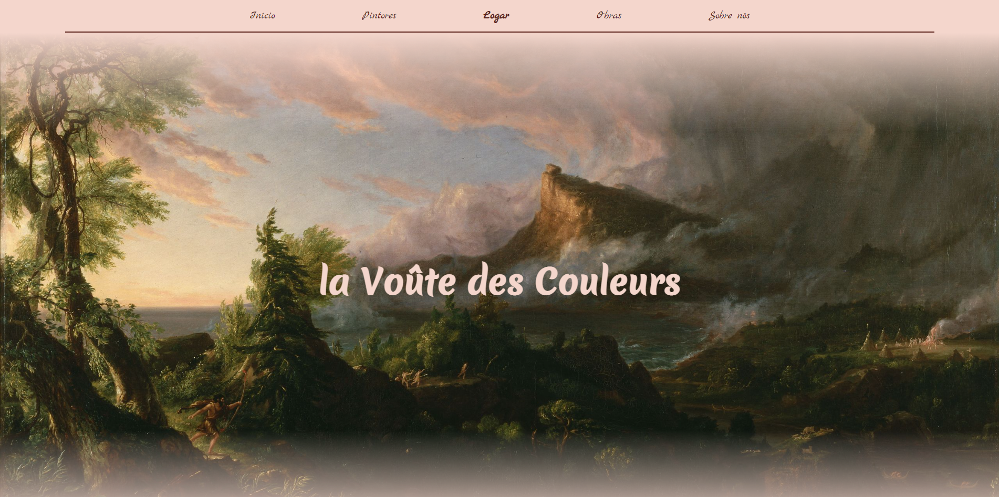

<h1 align="center"> la Voûte des Couleurs </h1>

    

# Sobre o Projeto

Projeto de capacitação em React e Ruby on Rails criado pela Diretoria Administrativa - Financeira da Struct e concluído em 17 de agosto de 2021. Essa capacitação ocorreu devido a transição no uso de Rails Full-Stack para o uso da biblioteca React (front-end) em conjunto com Ruby on Rails (back-end).

La Voûte des Couleurs é uma galeria digital com inúmeros artistas e pinturas de altíssima qualidade. O site conta também com conteúdos educativos referentes às pinturas, aos estilos e aos seus artistas. Para a inclusão ou remoção de conteúdo visual das páginas, o site possui uma página de Login e Logout para acesso do administrador.

Para acessar o site completo será necessário fazer uso do front-end em React localizada em [Capacitacao-Projetos-Front
](https://github.com/StructCE/Capacitacao-Projetos-Front).

## Membros responsáveis pelo projeto:

- [Arthur Mota Furtado](https://github.com/BomDia12)
- [Guilherme Rodrigues](https://github.com/guilodron)
- [Iago Carvalho](https://github.com/carvalhoiago)
- [Kayran Vieira](https://github.com/DraculK)

# Requisitos e ferramentas utilizadas

- [Ruby](https://www.ruby-lang.org/pt/downloads/) (v2.7.2)
- [Rails](https://guides.rubyonrails.org/) (v6.0.3)
- [Git](https://git-scm.com/downloads)
- [PostgreSQL](https://www.postgresql.org/download/)

# Como clonar e rodar o projeto em sua máquina

### `git clone https://github.com/StructCE/Capacitacao-Projetos-Api.git`

Clona o repositório para uso local em seu computador.

### `bundle` ou `bundle install`

Instala todas as dependências e gems do arquivo Gemfile necessários para o rodar o projeto rails.

### `rails db:reset`

Derruba o banco de dados e cria um novo 

### `rails s`

Inicializa o servidor Rails.

O servidor por padrão será aberto em [http://localhost:3000](http://localhost:3000).

Para abrir o servidor em outra porta use `rails s -p <port>`
